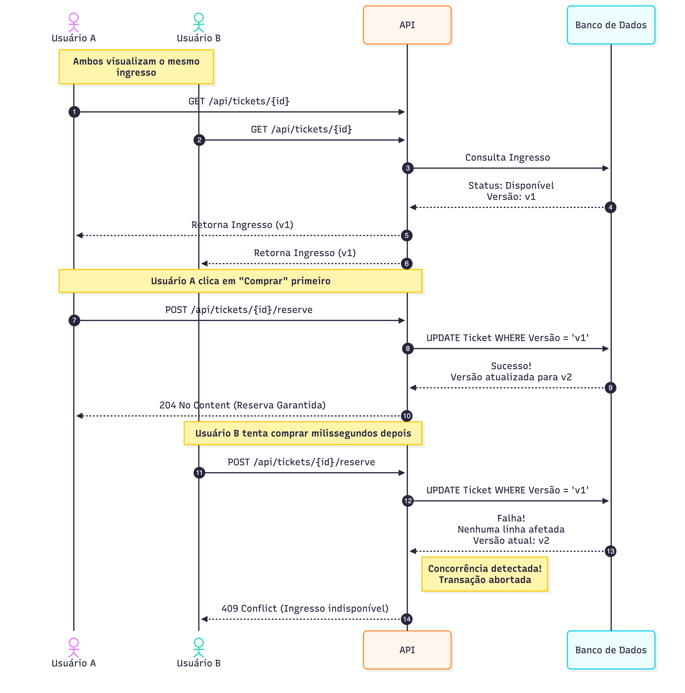

# TicketFlow

A high-performance Ticket Reservation System built with **C# 14** and **.NET 10**. This project serves as an engineering sandbox to explore **Concurrency Control**, **Data Integrity**, and **Robust Persistence** patterns, evolving beyond simple CRUD operations to handle race conditions in a distributed environment.

## Table of Contents

- [Prerequisites](#prerequisites)
- [How to Run](#how-to-run)
- [Project Structure](#project-structure)
- [Architecture & Design Principles](#architecture--design-principles)

## Prerequisites

Ensure you have the following installed to run this project efficiently:

- **[.NET 10 SDK](https://dotnet.microsoft.com/en-us/download/dotnet/10.0)** (or later)
- **[Docker Desktop](https://www.docker.com/)** (Required to orchestrate the SQL Server database)
- **IDE:** [Visual Studio](https://visualstudio.microsoft.com), [Visual Studio Code](https://code.visualstudio.com/), or [Rider](https://www.jetbrains.com/rider/).

## How to Run

### 1. Clone the Repository

```bash
git clone https://github.com/kauatwn/dotnet-concurrency-optimistic-locking.git
```

### 2. Enter the Directory

```bash
cd dotnet-concurrency-optimistic-locking
```

### 3. Run with Docker

This command builds the API, starts the SQL Server, and **automatically applies migrations** on startup.

```bash
docker compose up -d
```

*The API documentation will be accessible at `https://localhost:8081/swagger`.*

### 4. Execute Tests

To validate concurrency handling, domain logic, and time-dependent rules:

```bash
dotnet test
```

## Project Structure

The solution follows the **Clean Architecture** principles to ensure separation of concerns and testability, with a dedicated split between Unit and Integration testing.

```plaintext
dotnet-concurrency-optimistic-locking/
├── src/
│   ├── TicketFlow.API/               # Entry point, Controllers, Global Exception Handling
│   ├── TicketFlow.Application/       # Use Cases (MediatR), Behaviors, DTOs
│   ├── TicketFlow.Domain/            # Aggregate Roots, Value Objects, Pure Logic
│   └── TicketFlow.Infrastructure/    # EF Core, Concurrency Handling, TimeProvider
└── tests/
    ├── TicketFlow.UnitTests/         # Domain Logic & Time Travel Tests
    └── TicketFlow.IntegrationTests/  # Race Condition Simulations & DB Tests
```

## Architecture & Design Principles

This repository prioritizes **software engineering quality** and **maintainability**, following strict development guidelines.

### 1. Domain-Driven Design (DDD)

The core logic resides entirely within the `Domain` layer.

- **Aggregate Roots:** `Ticket` acts as a transactional boundary. Operations like `Reserve()` enforce invariants immediately.
- **Method Injection:** Entities do not depend on `DateTime.UtcNow`. Instead, they receive the `currentDate` as a parameter, making them pure and testable.
- **Value Objects:** Concepts like `Seat` (Sector/Row/Number) are immutable and structural.

### 2. Design Patterns

The project utilizes established patterns to ensure modularity and scalability.

| Pattern | Usage Scenario | Implementation |
| --- | --- | --- |
| **Unit of Work** | Ensuring atomic transactions | `IUnitOfWork` |
| **Optimistic Locking** | Handling concurrent writes | `RowVersion` (Timestamp token) |
| **CQRS** | Segregating Reads/Writes | `MediatR` (Commands vs Queries) |
| **Global Error Handling** | Standardizing API errors (409/400) | `IExceptionHandler` |

### 3. Concurrency & Locking Strategy

To prevent "double booking" without killing performance, we made specific engineering decisions.

> [!IMPORTANT]
> **Architectural Decision: Optimistic Locking**
> To handle high-concurrency scenarios (e.g., thousands of users trying to buy the same seat), we implemented **Optimistic Locking**:
>
> - **Why not Pessimistic Locking?** Keeping database rows locked (`SELECT FOR UPDATE`) while the user "thinks" or pays would degrade performance and throughput significantly.
> - **How it works:** If two users read the same ticket version, the first one to write wins. The second one triggers a `DbUpdateConcurrencyException`, which we catch in the `UnitOfWork` and translate to a **409 Conflict** response.


_Figure 1: Sequence diagram demonstrating the race condition handling and the 409 Conflict response._

### 4. Comprehensive Testing Strategy

The project adopts a strategy focused on **Time** and **Parallelism**.

- **Unit Tests (Time Travel):** We use time injection through method parameters to simulate shows in the past or future without dirty hacks like `Thread.Sleep`.
- **Integration Tests:** We spawn separate Service Scopes to simulate concurrent users (`Task.WhenAll`) hitting the real database to prove the locking mechanism works.

> [!NOTE]
> **Testing Isolation Strategy**
> Unlike standard CRUD tests, our integration tests **intentionally** share resources (the same Ticket ID) to provoke Race Conditions and validate that the system rejects the second attempt.

### 5. Manual Verification (Sandbox Walkthrough)

Since this project focuses on **Concurrency** rather than CRUD, follow this specific flow to manually validate the **Optimistic Locking** mechanism via Swagger:

#### Step 1: Discover Available Tickets

The application automatically seeds the database with a Show (ID: `11111111-1111-1111-1111-111111111111`) and 50 Tickets.

1. Call the endpoint using the **Fixed Show ID**:
    - **GET** `/api/shows/11111111-1111-1111-1111-111111111111/tickets`
    - *Copy the `id` of the first ticket in the list.*

#### Step 2: Reserve the Ticket (Success Scenario)

Send a reservation request for the copied Ticket ID.

- **POST** `/api/tickets/{ticketId}/reserve`
- **Body:**

    ```json
    {
      "customerId": "aaaa1111-bb22-cc33-dd44-eeee55556666"
    }
    ```

- **Result:** `204 No Content` (The ticket is now reserved).

#### Step 3: Trigger Race Condition (Conflict Scenario)

Immediately try to send the **exact same request** again (simulating a second user trying to buy the same seat).

- **Result:** `409 Conflict`
- **Response Body:**

    ```json
    {
      "type": "https://tools.ietf.org/html/rfc7231#section-6.5.8",
      "title": "Resource Conflict",
      "status": 409,
      "detail": "Seat 'VIP - A1' is already reserved or sold."
    }
    ```

> This proves that the **Domain Layer** successfully intercepted the invalid state transition or the **Infrastructure Layer** caught the `DbUpdateConcurrencyException`.

### 6. Known Limitations (Trade-offs)

> [!WARNING]
> **Trade-off: Max Tickets Per User**
> To maximize performance, the `Ticket` aggregate is isolated, and the `MaxTicketsPerUser` rule is checked only within the current transaction scope. In a distributed race condition, a user might exceed their quota.
>
> **Production Considerations:** In a full-scale production environment, this specific edge case would be mitigated by implementing **eventual consistency checks** (Background Worker) or a **dedicated counter table** with strict Database Constraints. For this sandbox, we prioritize the clarity of the core Locking mechanism.

### 7. CI/CD & Quality

The project includes configuration for automated quality checks:

- **Parallel Testing:** Ensures the system handles load correctly.
- **Static Analysis:** Strict compiler warnings enabled to ensure type safety.
- **Docker Build:** Verifies that the container image builds successfully via Compose.
